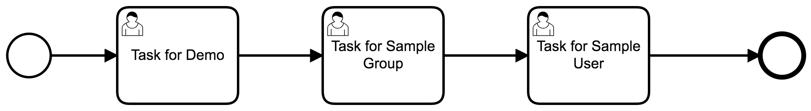

# Camunda Custom Rest Api Demo
A sample application with a custom rest controller, that changes the authorization behaviour for claiming and completing tasks. 

## Show me the important parts!


## How does it work?
This application contains a custom rest controller, which validates the authorization of the user used when claiming and completing a user task in Camunda ([UserTaskRestController](src/main/java/com/camunda/consulting/controllers/UserTaskRestController.java)).

It basically validates the authorization with the userId provided in both claim and complete rest calls.

## How to use it?
* Start this application. You can use the following command:
```
mvn clean spring-boot:run
```

* Start a process instance of the UserTaskDemoProcess.
* Try to assign the first task to the user sample user, with the following rest call:

POST /custom/task/{id}/claim

```
{
    "userId":"sampleuser"
}
```

You should get a similar error as below:

```
{
    "timestamp": 1600428435175,
    "status": 403,
    "error": "Forbidden",
    "message": "Cannot claim task 1dd0de41-f90d-11ea-b012-acde48001122: no authorizations found for the user sampleuser",
    "path": "/custom/task/1dd0de41-f90d-11ea-b012-acde48001122/claim"
}
```

You can also try to complete the task with the following payload:

POST /custom/task/{id}/complete

```
{
    "userIdDto": {
        "userId": "sampleuser"
    },
    "completeTaskDto": {
        "variables":{
            "someVar":{
                "value":"someVal"
            }
        },
        "withVariablesInReturn": true
    }
}
```

You should get a similar error as before:

```
{
    "timestamp": 1600428435175,
    "status": 403,
    "error": "Forbidden",
    "message": "Cannot complete task 1dd0de41-f90d-11ea-b012-acde48001122: no authorizations found for the user sampleuser",
    "path": "/custom/task/1dd0de41-f90d-11ea-b012-acde48001122/claim"
}
```

For the next tasks, it should be possible to claim and complete using the user "sampleuser", due to their configuration in the process.

For more reference, you can check the tests done in the class [UserTaskRestControllerTest](src/test/java/com/camunda/consulting/controllers/UserTaskRestControllerTest.java).

## Environment Restrictions
This project uses Camunda Spring Boot 7.13.4-ee.

## Known Limitations
